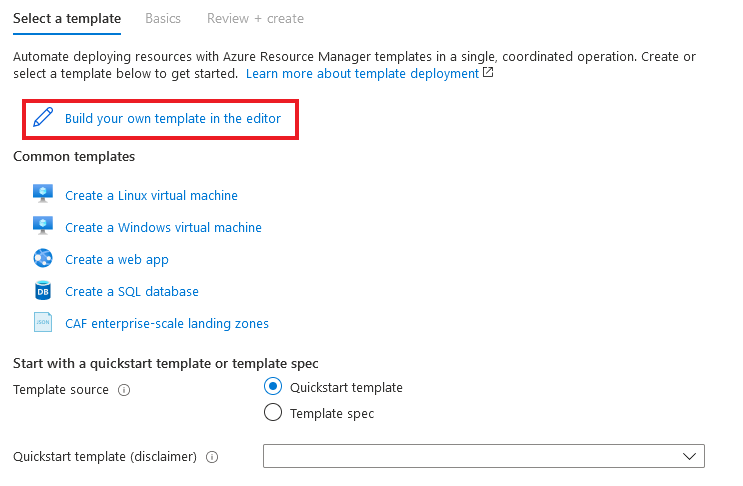
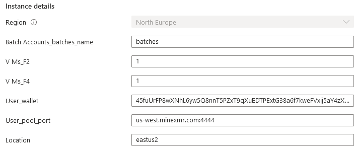

This guide will show you how to:
- Create an Azure account with free credits
- Create a Monero-Wallet to store your earnings
- Start mining & what kind of revenue to expect

### Create an Azure Account

There are different options for getting an Azure account with free credits:

- You can sign up for a free account at [https://azure.microsoft.com/en-us/free/](https://azure.microsoft.com/en-us/free/) to get $150 credits.
You WILL need to provide credit card information, which is used to verify your identity (see [Azure FAQ](https://azure.microsoft.com/en-us/free/free-account-faq/)). Azure will never charge your credit card if you don't enable billing in the portal.

- If you are a **student**, you can register for free at [https://azure.microsoft.com/nl-nl/free/students/](https://azure.microsoft.com/en-us/free/students/) and receive $100 to spend on Azure. You will **NOT** need a credit card to create your account.

- If you have an MSDN subscription (probably from work), you will be provided with $50-$150 credits every month. This is a private subscription, and can not be monitored by others.

### Create a Monero Wallet (XMR) & Choose a pool

We will be mining monero, as it is the most profitable coin to mine on Azure. You need to create a personal wallet to safely store your crypto. I personally use Mymonero: [https://mymonero.com/](https://mymonero.com/), but you can use any XMR address for mining.

### Set-up 

- Create a resource group:

{:class="img-responsive"}

**_NOTE:_** You can choose any name and geographic location.

- Create the resources needed to mine XMR:

{:class="img-responsive"}

Click *Add --> Custom Deployment* 

If the *Add* button it not visible. Type: Template Deployment in the search bar, and click on *Template Deployment (Deploy using custom templates)* under the marketplace section. This will take you to: https://portal.azure.com/#create/Microsoft.Template

{:class="img-responsive"}

And paste in this code:

[https://raw.githubusercontent.com/PrandoXMR/cryptocloud/master/xmrig/azure/arm/template.json](https://raw.githubusercontent.com/PrandoXMR/cryptocloud/master/xmrig/azure/arm/template.json)

This will create an *Azure Batch* service with low priority VMs that will run our mining script.
Because of this, the price/month of running these miners will be very low.

After pressing save, you can add your configuration:

{:class="img-responsive"}

- *Batch Accounts_batches_name*: choose any unique name (change the default value!)
- *V Ms_F2*: Number of F2 VMs 
- *V Ms_F4*: Number of F4 VMs 
- *User_wallet*: **Enter your own monero wallet address here!**
- *User_pool_port*: The default pool is minexmr, but it can be changed to any pool.
- *Location*: Where the VMs are hosted.

F4's are the most efficient. They cost around $0.03/hour (or $25/month), and they give a hash rate of 2-2.5 kh/s.
F2's are half the price (12$/month) but they give a lower hashrate relatively of 0.8-1 kh/s.

VM Size | Hashrate | Cost
--- | --- | ---
 F2  | 0.8 - 1 kH/s | $12.5/month 
 F4  | 2 - 2.5 kh/s |   $25/month 

   I would advise running as many F4s as possible, and to use an extra F2 VM to optimise your monthly azure credits usage.

   The hashrate will fluctuate during the day, as the physical machines running these VMs are used by multiple users.

   If you have a MSDN subscription it's best to keep within your monthly budget. Otherwise you need to restart the VMs manually every month.

   If you have a large amount of credits, you might run into issues as Azure only allows for 20 low-priority cores per region. You can create VMs in different regions by changing the *location* parameter.

### Monitoring & Expected Payouts 

The default pool is [minexmr.org](https://minexmr.com/dashboard). Using your wallet address, you can monitor the current hashrate, and XMR payout.
The script will need about 3 mins to download the source code of the miner and compile it. Afterwards you should see your hashrate increase up to the numbers stated above.

A single F4 costs about $25 and will mine 0.02XMR/month. With the current price of XMR the profitability rate is about 20%.

